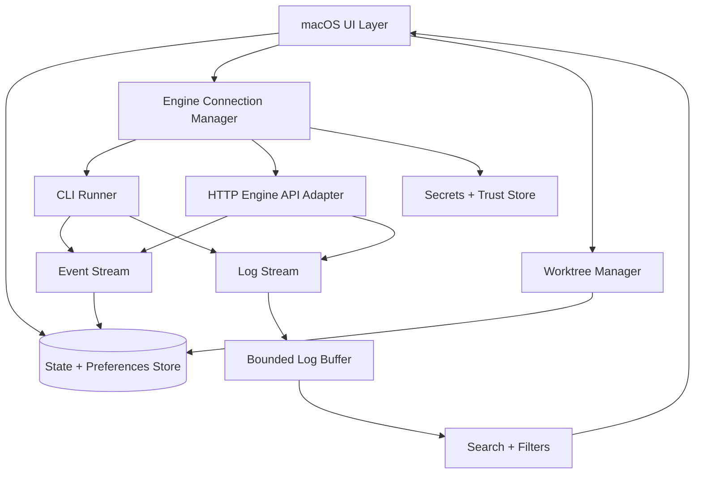
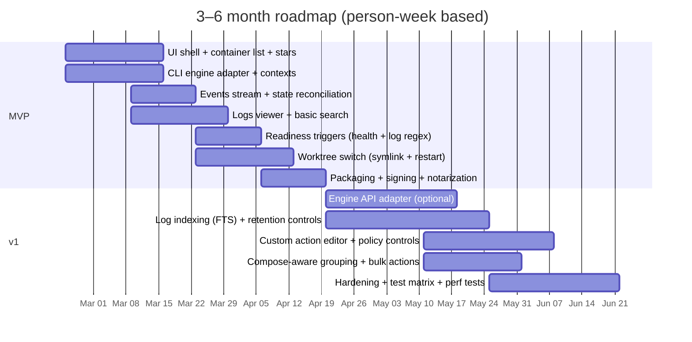

# Building an Open-Source macOS App to Replace Docker Desktop’s UI Layer

## Executive summary

A lightweight, open-source macOS app that replaces *Docker Desktop’s UI layer* (not its VM/runtime layer) is feasible and can be built with a small footprint, limited scope, and a native macOS UX—provided you explicitly depend on an existing Docker Engine endpoint (local or remote) rather than trying to ship a container runtime yourself. This distinction is essential: Docker Desktop bundles a GUI and a “complete Docker development environment” (including Docker Engine) and—on macOS—relies on a Linux VM managed by selectable virtual machine managers. citeturn25view0turn19view0

The strongest “minimal footprint + native UX” approach is a SwiftUI-first macOS app with targeted AppKit use for high-performance log rendering, paired with **CLI-first integration** (invoking `docker` and `git`) for MVP and an optional **Engine API** adapter for v1 to reduce subprocess overhead and enable better streaming behavior. Docker officially documents both the Docker Engine API (REST over HTTP) and the Docker CLI surface; most operations map cleanly between CLI commands and Engine API endpoints. citeturn20view0turn8view0turn18view0turn18view1

Key constraints and risks are dominated by **privilege/security**, **Apple distribution rules**, and **log-scale performance**:

- **Privilege/security:** Docker’s own documentation warns that enabling remote access can allow non-root users to obtain *root access on the host* if not properly secured, and it strongly recommends TLS/SSH protections. Your UI effectively becomes a high-impact control plane and must be designed accordingly. citeturn20view3turn20view4  
- **Apple App Store viability:** Apple’s App Review Guidelines restrict reading/writing outside the app’s container, and prohibit downloading/installing/executing code that changes functionality; Mac App Store apps are also constrained in update mechanisms and escalation. A full-featured Docker-control app (especially with Git repo scanning + external tool invocation) is dramatically easier to ship **outside the Mac App Store** as a Developer ID–signed and notarized app. citeturn11view0turn12view4  
- **Logs/search:** Container logs can be extremely large and may be multiplexed; advanced search requires careful buffering/indexing and strict resource caps. Docker documents both CLI log streaming/timestamps and Engine API log streaming formats. citeturn18view0turn17view0turn9view0

Recommended delivery plan: MVP in ~10–14 person-weeks (single engineer: ~2.5–3.5 months) for a *starred-containers + actions + logs viewer + readiness triggers + worktree switch via symlink + restart* workflow; v1 in an additional ~14–20 person-weeks to add indexed log search, richer per-project Git/Compose integration, hardened security posture, and robust reconnect/stream handling.

AI tooling recommendation: use **Claude Code** for rapid refactoring, test generation, and CI automation, and **Codex** for parallelizable implementation tasks (e.g., building the log pipeline and the Engine API adapter in parallel), with tight human review gates and deterministic test verification. Claude Code and Codex both explicitly position themselves as agentic coding tools that can read/edit files and run commands/tests. citeturn27view2turn27view0turn27view1

## Feasibility and constraints

### “Replace Docker Desktop” needs a precise boundary

Docker Desktop is presented as a one-click install app providing a GUI plus a “complete Docker development environment” (including Docker Engine) to build/run containers. citeturn25view0 On macOS, Docker Desktop uses a Linux VM to run containers; Docker documents that Docker Desktop supports multiple VMMs “to power the Linux VM that runs containers.” citeturn19view0

Your proposed app is therefore best framed as:

- A **visualization + control UI** that targets an already-running Docker Engine endpoint (local socket, remote TCP/TLS, or Docker context). citeturn20view2turn20view0  
- Explicitly **out of scope** for MVP: shipping a Linux VM manager, file sharing implementation, Kubernetes bundle, etc. (all of which Docker Desktop highlights as key product features). citeturn25view0turn19view0

This boundary keeps the footprint small and avoids competing with Docker Desktop’s VM/runtime responsibilities.

### Licensing and distribution realities

Docker Desktop licensing (and user obligations) are a major adoption driver. Docker’s documentation states Docker Desktop is licensed under the Docker Subscription Service Agreement and is free only for specific categories (small businesses under thresholds, personal use, education, and non-commercial open source), while requiring paid subscriptions for professional use in larger organizations and other cases. citeturn19view1

Important implication: If your users run Docker Engine *via Docker Desktop*, they remain subject to Docker Desktop licensing terms regardless of which UI they use. Your app can help users avoid Docker Desktop licensing only if they point it at a non–Docker Desktop engine (e.g., remote Linux host or another local engine provider).

On the open-source side, the upstream engine/CLI components are permissively licensed: the **entity["organization","Moby Project","open-source container engine"]** repository and the Docker CLI repository both use Apache License 2.0. citeturn3search0turn3search1turn19view1

### Apple App Store constraints vs. practical requirements

Apple’s App Review Guidelines include restrictions that collide with typical Docker-control workflows:

- Apps must be “self-contained” and may not read/write outside their container area, nor “download, install, or execute code” that changes functionality (with limited educational exceptions). citeturn11view0  
- Mac App Store apps have additional behavioral constraints (e.g., update mechanisms must use the Mac App Store; other update mechanisms are not allowed). citeturn11view1  

A Docker UI that (a) invokes external executables (`docker`, `git`), (b) accesses arbitrary repos/worktrees, and (c) maintains persistent settings tied to user filesystem locations is *possible* under sandboxing but becomes UX-hostile (requiring user-selected-file workflows and security-scoped bookmarks everywhere).

For open-source distribution, Apple’s Xcode guidance explicitly supports distributing outside the Mac App Store by signing with a Developer ID and optionally notarizing; notarization requires hardened runtime. citeturn12view4 This path is the most compatible with the product you described.

## Architecture options

### Integration patterns: CLI-first, API-first, or hybrid

Docker documents two “official” integration avenues:

- **Docker Engine API:** Docker describes the Engine API as a RESTful HTTP API and notes official SDKs for Go and Python. citeturn20view0  
- **Docker CLI:** The CLI offers stable commands for listing containers, logs streaming, events streaming, inspect JSON output, contexts, etc. (and the CLI can be pointed at different endpoints via contexts). citeturn18view0turn18view1turn18view4turn20view2

The Engine API OpenAPI (Swagger) spec further states: it is “the API the Docker client uses,” most client commands map directly to endpoints (e.g., `docker ps` → `GET /containers/json`), the API is versioned, and clients must tolerate extra fields due to its open schema model. citeturn8view0turn9view1

**Practical recommendation**

- **MVP:** CLI-first + persistent `docker events` and `docker logs --follow` subprocesses, parsing JSON/lines, to minimize bespoke HTTP/TLS/socket code in Swift. This leverages Docker’s documented CLI behaviors (timestamps, since/until, last 256 events, etc.). citeturn18view0turn18view1  
- **v1:** Add an Engine API adapter for performance-critical paths (container list, inspect detail fetch, event streaming, logs streaming), using Docker’s published endpoints and streaming formats. citeturn9view1turn9view2turn9view0turn17view0  

A hybrid allows you to keep a small UI binary while moving the “engine adapter” behind an interface so you can switch implementations (CLI vs API) without rewriting UI logic.

### Core components and data flow

The Engine API spec documents the key endpoints you’ll rely on for containers, logs, and lifecycle operations: listing containers (`/containers/json`), inspecting (`/containers/{id}/json`), start/stop/restart (`/containers/{id}/start|stop|restart`), and logs (`/containers/{id}/logs`). citeturn9view1turn15view3turn9view0

At the CLI layer, the analogous tools are `docker container ls`, `docker container inspect`, `docker container logs`, `docker system events`, and lifecycle commands like `docker container restart`. citeturn18view3turn18view4turn18view0turn18view1turn18view2

Below is a reference architecture that fits your “minimal footprint, limited functionality” targeting:

Design notes grounded in Docker/Apple behaviors:

- Prefer events streaming (CLI/Engine API) vs polling, since Docker provides real-time events and documents both event types and event limits in the CLI. citeturn18view1turn9view2  
- Treat “engine connection” as a profile, aligning with Docker contexts as stored configurations with endpoints and TLS info. citeturn20view2  
- Cap log buffering and indexing strictly; Docker logs support streaming and timestamp injection, but volume can be unbounded. citeturn18view0  

## Feature-by-feature implementation analysis

The tables below focus on the features you required, with (a) implementation approach, (b) dependencies, (c) Docker APIs/CLI, (d) edge cases, and (e) performance implications.

### Starring containers

| Aspect | Analysis |
|---|---|
| Implementation approach | Maintain a local “favorites” set keyed by a stable identifier. Prefer a composite key: `{engine-context, container labels (Compose project/service if present), container name}` with fallback to container ID. Use Docker events to update starred container state in real time. citeturn18view1turn23view0turn20view2 |
| Dependencies | Local persistence (e.g., a small SQLite/JSON file). Optional: read Compose labels to group favorites by project. Compose requires labeling resources with `com.docker.compose.project`. citeturn23view0 |
| Docker CLI commands | `docker container ls --all --format …` to render list rows and include labels; the `--format` placeholders include `.Labels` and `.Status` (with health detail). citeturn18view3 |
| Docker Engine API | `GET /containers/json` for list; `GET /containers/{id}/json` for detail. The API spec explicitly calls out list vs inspect representation differences. citeturn9view1turn15view3 |
| Edge cases | Container IDs change after recreate; Compose names can change with scale; labels can be missing; multiple containers can share an image/name pattern; remote contexts can have colliding names. Compose label is the cleanest stable grouping when available. citeturn23view0turn20view2 |
| Performance implications | Polling `docker ps`/`GET /containers/json` frequently is wasteful; prefer one long-lived event stream (`docker events` or `GET /events`) and refresh details on demand. Docker limits CLI event history to the last 256 events, so reconnect logic must handle missed transitions by resyncing container list. citeturn18view1turn9view2 |

### Customizable action buttons (restart/stop/start/exec/etc.)

| Aspect | Analysis |
|---|---|
| Implementation approach | Provide an “action registry” with (1) built-in safe actions (start/stop/restart/logs/inspect), and (2) user-defined “macros” that parameterize a restricted set of Docker operations (avoid arbitrary shell templates in MVP). Expose actions as configurable buttons per container/group (starred set, Compose project, image). citeturn18view2turn23view0 |
| Dependencies | Preferences storage; a command runner that passes arguments without shell interpolation; optional confirmation prompts for destructive actions. |
| Docker CLI commands | `docker container restart` (supports stop signal and timeout). citeturn18view2  `docker container stop` (SIGTERM then SIGKILL; configurable via STOPSIGNAL). citeturn26search1  `docker container start`. citeturn26search0  `docker container exec` for “shell / run command,” noting exec runs only while PID 1 is running and is not restarted when the container restarts. citeturn26search2 |
| Docker Engine API | `/containers/{id}/start`, `/stop`, `/restart` are direct endpoints; restart/stop accept `signal` query param (documented in API history) and `t` timeout is exposed in the OpenAPI spec. citeturn9view0turn22view0 |
| Edge cases | “Restart” on stopped container should map to “start” semantics in UI; `exec` should be disabled when container isn’t running; stop/restart behavior depends on the image’s configured stop signal and configured timeouts. citeturn18view2turn26search2 |
| Performance implications | Actions are bursty and typically not performance-critical; risk is UX latency if each click cold-starts a `docker` process. Keep a lightweight process pool or serialize invocations, and reuse a single engine-connection strategy. Docker contexts help keep targeting consistent across invocations. citeturn20view2 |

### Viewing logs and advanced log search

| Aspect | Analysis |
|---|---|
| Implementation approach | **MVP:** streaming viewer + basic search (substring/regex) over a bounded in-memory ring buffer, with optional “export to file.” Use timestamps and `--since/--tail` to bound fetches. Docker’s CLI adds RFC3339Nano timestamps and supports `--since` and `--until`. citeturn18view0  **v1:** optional local indexing for starred containers (SQLite FTS) with retention policies (max MB per container, max days). |
| Dependencies | Regex engine; bounded log buffer; optional database (SQLite). If using Engine API logs, implement stream decoding. |
| Docker CLI commands | `docker container logs` is documented to batch-retrieve logs “present at the time of execution,” and `--follow` continues streaming stdout/stderr. citeturn18view0 |
| Docker Engine API | `GET /containers/{id}/logs` supports log streaming but “works only for containers with the json-file or journald logging driver.” citeturn9view0  API history documents that logs endpoints set Content-Type to `application/vnd.docker.multiplexed-stream` when multiplexed and `application/vnd.docker.raw-stream` otherwise. citeturn22view0 |
| Stream decoding details | Docker documents the multiplexed stream framing: an 8-byte header identifying stream type (stdout/stderr) and payload size, followed by payload bytes; it also documents the non-multiplexed raw stream behavior when TTY is enabled. citeturn17view0turn17view1 |
| Edge cases | Non-supported logging drivers (API limitation); huge logs; multiline log entries; containers that emit binary/ANSI sequences; clock skew between host UI and remote engine affecting `--since` semantics; logs that rotate quickly. The UI must communicate driver/availability constraints and offer fallbacks (e.g., “logs unavailable via API/driver”). citeturn9view0turn18view0 |
| Performance implications | Log streaming can overwhelm UI if you append unbounded text. Use chunked ingestion, periodic UI updates (e.g., 10–30 Hz max), log-level filtering, and strict caps on in-memory retention. Prefer “lazy load older logs” via `--since/--until` rather than preloading full history. citeturn18view0 |

### Container-ready state detection via custom log triggers

| Aspect | Analysis |
|---|---|
| Implementation approach | Provide a readiness model with three tiers: (1) container health status when available; (2) lifecycle events (start/restart/health_status) to anchor timing; (3) user-defined regex triggers on logs (“ready when line matches …”). Docker events explicitly include `health_status` as a container event. citeturn18view1turn9view2 |
| Dependencies | Event stream subscription; a trigger engine (regex + optional “must match N times”); per-container trigger config stored locally. |
| Docker CLI commands | `docker events` provides real-time events and lists container event types including `health_status`, `start`, `restart`, `die`, etc. Docker documents that only the last 256 events are returned (so long-lived subscriptions are preferred). citeturn18view1  For log triggers, use `docker logs --follow --since … --timestamps` for deterministic correlation. citeturn18view0 |
| Docker Engine API | `GET /events` supports streaming and accepts `filters` as a JSON-encoded map. citeturn9view2  For readiness details, use `GET /containers/{id}/json` and, when healthchecks exist, parse the health structure. The OpenAPI spec includes Health structures and indicates health summary presence in container summaries as of API v1.52. citeturn15view1turn15view3 |
| Edge cases | No healthcheck present → health fields may not exist; a log trigger may match on old lines unless you anchor “since container start time”; rapid restart loops can create false “ready” transitions; log driver limits on API logs. Build the UX to prefer healthchecks when present and treat log triggers as best-effort heuristics. citeturn18view0turn9view0 |
| Performance implications | Event streaming is efficient; log-trigger matching can be expensive if you run regex over all logs for many containers. Scope triggers to starred containers and only during defined windows (e.g., after start/restart). Use compiled regex and short-circuit matching. citeturn18view1 |

### Native Git worktree switching without rebuilding containers

Your requirement (“switch worktree under the hood and restart container to load new code”) is realistic if—and only if—the container setup uses **bind mounts** (or file shares) so code is *mounted*, not baked into an image. The most compatible MVP design is therefore **worktree switch + filesystem indirection + restart**, not container recreation.

| Aspect | Analysis |
|---|---|
| Implementation approach | Detect a Git repo root, enumerate worktrees, and let the user select an “active” worktree. Implement switching by repointing a stable path (e.g., a symlink like `repo/.worktree/current`) to the selected worktree directory, then restarting the relevant container(s) so watchers reload. Git’s `worktree` is designed for multiple working trees attached to the same repo. citeturn24view0 |
| Dependencies | `git` executable; permissions to read/write the repo directory; local config mapping container ↔ repo root ↔ mount path convention. If sandboxed, you must rely on user-selected file access entitlements and/or security-scoped bookmarks; Apple documents that sandbox adoption requires entitlements for access outside the app container. citeturn21view1turn21view2 |
| Git commands | `git worktree list --porcelain` (machine-parseable) and optional `git worktree add/remove` for management. Git documents worktree creation, listing, and the semantics of linked worktrees. citeturn24view0 |
| Docker CLI commands | `docker container restart` on the app container to pick up new mounted code and restart watchers. citeturn18view2  For multi-container apps grouped by Compose project, discover containers via the required `com.docker.compose.project` label and apply restart to that set (or provide a “restart project” action). citeturn23view0turn18view3 |
| Docker Engine API | Use `/containers/json` + labels to find related containers; restart via `/containers/{id}/restart`. citeturn9view1turn9view0 |
| Edge cases | Worktree may be locked, prunable, or missing; `git worktree add` can refuse if a branch is already checked out elsewhere unless forced. citeturn24view0  Symlink-following behavior across macOS file sharing into a Linux VM may differ by engine provider; you need a fallback if the mount doesn’t observe symlink target changes quickly (e.g., “touch file, restart again,” or document a “mount the parent directory containing all worktrees” convention). citeturn19view0 |
| Performance implications | Worktree switching via symlink is O(1) locally and avoids image builds. Restart cost depends on container startup time and stop signal/timeout behavior. citeturn18view2 |

## Frameworks, languages, and tooling

### Framework trade-offs table: native vs web-based shells

The “minimal footprint + native UX” target strongly disfavors bundling heavy web runtimes. Electron explicitly embeds Chromium and Node.js into its binary. citeturn2search0 Tauri positions itself around smaller bundle size by using the system’s native webview and a Rust backend. citeturn2search9turn2search1 SwiftUI is Apple’s native UI framework for building app structure and views. citeturn2search2

| Option | Performance | Dev speed | Binary size / footprint | Native macOS integration | Learning curve |
|---|---|---|---|---|---|
| SwiftUI + AppKit | Excellent for native rendering; fastest path to “Mac-like” UX. citeturn2search2 | Medium | Smallest (system frameworks already on macOS) | Best (menus, keychain, window behaviors, accessibility) | Medium if team is new to Apple platforms |
| Tauri (Rust backend + web UI) | Good; native webview avoids bundling Chromium. citeturn2search9turn2search1 | High (web UI iteration) | Smaller than Electron (system webview) citeturn2search9 | Medium (bridges exist, but macOS polish requires effort) | Medium–High (Rust + frontend stack) |
| Electron (Node + Chromium) | Good enough, but heavier runtime | Highest for web teams | Large (bundles Chromium + Node.js) citeturn2search0 | Medium (native polish possible but non-trivial) | Low for web devs |
| Python UI stacks | Varies | Medium | Often large due to packaging interpreter | Medium | Low–Medium |
| Go/Rust “native UI” (without SwiftUI) | Varies; many options are less native on macOS | Medium | Medium | Medium | Medium |

### Recommended implementation stack

**Primary recommendation (best match to your attributes):**
- **SwiftUI + selective AppKit** for UI (log viewer + search UI often benefits from AppKit text components for large content). citeturn2search2turn18view0  
- **CLI-first Docker integration** in Swift for MVP: invoke `docker` and rely on documented CLI behavior for logs, events, inspect JSON, etc. citeturn18view0turn18view1turn18view4  
- **Optional Engine API adapter** for v1 (Swift or a small Rust/Go helper), driven by Docker’s OpenAPI spec and documented streaming formats/endpoints. citeturn8view0turn17view0turn9view0  

**When Rust/Go/Python/Node make sense**
- **Go or Python** if you decide to embed or ship a separate engine-adapter service, because Docker explicitly documents SDKs for Go and Python. citeturn20view0turn20view1  
- **Rust** if you prefer a Tauri-based UI and want a compact backend binary with strong concurrency primitives (and you accept a webview UX layer). citeturn2search9turn2search1  
- **Node** primarily if you choose Electron (but that conflicts with “minimal footprint”). citeturn2search0  

### Where to use Claude Code and Codex effectively

Both Claude Code and Codex are explicitly positioned as agentic coding tools that can read/edit code and run commands/tests. Claude Code’s docs describe it as reading your codebase, editing files, running commands, integrating with dev tools, and helping automate tasks like writing tests and fixing lint errors; it also supports CI integration and working with git. citeturn27view2 Codex is described as a cloud-based software engineering agent capable of writing features, fixing bugs, proposing PRs, and running tests in isolated sandbox environments; the Codex app is designed to manage multiple agents and run work in parallel. citeturn27view0turn27view1

Recommended usage pattern for your project:
- **Codex:** parallelize “hard but well-specified” components (Engine API adapter, log stream decoder, event subscription + reconnect logic), and generate PR-ready diffs that you review. citeturn27view0turn27view1  
- **Claude Code:** rapid iteration on SwiftUI view composition, refactors, test scaffolding, CI workflow edits, and “sweep” tasks (lint fixes, migrating APIs, adding structured logging). citeturn27view2  
- **Guardrails:** require deterministic tests to pass for any agent-generated change; keep all credentials secrets out of agent context; and prefer short-lived, reviewable tasks over broad “rewrite the app” prompts (both for quality and supply-chain safety). citeturn27view0turn27view2  

## Engineering plan, security posture, and open-source strategy

### Component-level breakdown and effort estimates

Estimates below assume a senior engineer familiar with macOS development and Docker. “MVP” means: starred containers, action buttons, logs viewer + basic search, readiness triggers, and worktree switching via symlink + restart (with clear conventions). “v1” adds: indexed log search, Engine API adapter, stronger policy controls, and robust project grouping.

| Component | MVP (person-weeks) | v1 add-on (person-weeks) | Notes |
|---|---:|---:|---|
| SwiftUI/AppKit UI shell (container list, detail pane, actions, settings) | 3–4 | 2–3 | Native UX polish tends to dominate iteration cycles. citeturn2search2 |
| Docker integration layer (CLI runner + parsing, contexts support) | 2–3 | 1–2 | Contexts give endpoints/TLS profiles and are stored per configuration; leverage `docker context` + `DOCKER_CONTEXT`. citeturn20view2turn14search10 |
| Events pipeline (stream + reconnect + state reconciliation) | 1–2 | 1–2 | `docker events` limits history; must resync with container list on reconnect. citeturn18view1turn9view1 |
| Logs viewer (streaming + bounded buffer + basic search) | 2–3 | 2–4 | Advanced search/indexing is v1; multiplexed stream decoding if API-based. citeturn18view0turn17view0 |
| Readiness triggers (health + log regex triggers + UX) | 1–2 | 1–2 | Event types include `health_status`; health data exists when configured. citeturn18view1turn15view1 |
| Worktree manager (enumerate + switch + restart mapping) | 2–3 | 1–2 | Based on `git worktree` semantics and conventions you define. citeturn24view0turn18view2 |
| Packaging, signing, notarization, auto-update channel | 1–2 | 1–2 | Developer ID distribution + notarization/hardened runtime workflow. citeturn12view4 |
| Testing + CI/CD (unit/integration UI tests, smoke tests on engine) | 1–2 | 2–3 | Add integration matrix (local+remote context), log stress tests, etc. citeturn20view2turn20view3 |
| **Total** | **10–14** | **11–20** | **MVP: ~2.5–3.5 months (1 dev). v1: +3–5 months (1 dev), or faster with 2 devs.** |

### Security, permissions, and sandboxing considerations

**Threat model: your app is a privileged orchestrator.** Docker warns that exposing the daemon to remote clients without appropriate security can enable host compromise, up to root access. citeturn20view3turn20view4

Concrete security requirements:

- **Connection trust:** default to Docker contexts (user selects a context). Contexts are explicitly designed to bundle endpoint config and TLS info, and Docker documents switching via `docker context use` or `DOCKER_CONTEXT`. citeturn20view2turn14search18  
- **No implicit remote enablement:** never “turn on” remote access; Docker documents remote access as a direct security risk and recommends TLS/SSH. citeturn20view3turn20view4  
- **Local secret storage:** store tokens/certs only in secure system storage; avoid writing sensitive material into logs/indexes.  
- **User-defined actions:** treat “custom buttons” as potentially dangerous; constrain to an allowlist of Docker operations in MVP, and add per-action confirmations and “show exact command/API call” transparency. (This is critical when your app may be used in regulated environments under Docker Desktop’s licensing rules.) citeturn19view1turn18view2  
- **Log privacy:** logs can contain secrets; advanced search indexing must be opt-in with clear retention and deletion controls.

**If you attempt Mac App Store distribution:** Apple’s guidelines constrain filesystem access and code execution behaviors; your app must remain self-contained and limited in filesystem access unless the user explicitly selects files, and cannot use non–App Store update mechanisms. citeturn11view0turn11view1 This conflicts with seamless repo/worktree switching and persistent multi-repo management.

**If you distribute outside the Mac App Store (recommended):** Apple’s guidance states you should sign with Developer ID and users gain additional assurance if the app is notarized; hardened runtime is required for notarization. citeturn12view4 You can still optionally sandbox, but you can also ship non-sandboxed to reduce friction, as long as you maintain a strong internal security posture.

### Prioritized minimal roadmap

A minimal roadmap that honors “limited functionality” and the required feature set looks like:

- **MVP scope (ship first):**  
  - Engine connection via context selection + “engine reachable?” status. citeturn20view2turn20view3  
  - Container list + star/unstar + starred-only filter. citeturn9view1turn18view3  
  - Built-in actions: start/stop/restart/logs (no arbitrary commands yet). citeturn26search0turn26search1turn18view2turn18view0  
  - Logs viewer with bounded buffer + basic search over buffer + copy/export. citeturn18view0  
  - Readiness: health when present + optional log regex trigger per starred container. citeturn18view1turn15view1  
  - Worktree: select repo root, list worktrees, switch symlink target, restart mapped container/project. citeturn24view0turn18view2turn23view0  

- **v1 scope (hardening + scale):**  
  - Engine API adapter option + streaming decode (multiplexed streams). citeturn17view0turn9view0turn20view0  
  - Indexed logs (SQLite FTS) with retention limits and per-container opt-in.  
  - Custom action button editor (templated + allowlisted) + confirmations.  
  - Compose-aware grouping (project label) and bulk actions per project. citeturn23view0  
  - Robust reconnect logic + “resync state from list” after disconnections. citeturn18view1turn9view1  

### Suggested project structure

Keep the repository modular so CLI-first and API-first adapters can coexist:

- `App/` (SwiftUI app entry, navigation, settings UI)  
- `Core/State/` (immutable models, reducers/view-models, persistence)  
- `Core/Engine/`  
  - `ContextDiscovery/` (context listing/select, endpoint health checks) citeturn20view2turn20view0  
  - `CLIAdapter/` (subprocess runner, parsers for JSON/line protocols) citeturn18view0turn18view1  
  - `APIAdapter/` (optional: HTTP client, event/log streaming decode) citeturn17view0turn9view2  
- `Core/Logs/` (buffering, filters, search, optional index) citeturn18view0turn17view0  
- `Core/Worktrees/` (git worktree parsing, symlink switch, mappings) citeturn24view0  
- `Tests/` (unit tests for parsers, trigger engine; integration harness for engine mock)

### CI/CD and testing strategy

**CI/CD**
- Use **entity["company","GitHub","code hosting platform"]** Actions for: build, unit tests, packaging, notarization steps, and release artifact publishing.  
- If distributing outside the Mac App Store, follow Apple’s Developer ID signing + notarization workflow (hardened runtime enabled). citeturn12view4  

**Testing layers**
- **Parser/unit tests:** ensure `docker events` and `docker logs` parsing is stable across edge cases; `docker logs --timestamps` uses RFC3339Nano. citeturn18view0turn18view1  
- **Stream decoder tests (v1):** validate multiplex headers and payload routing per Docker’s documented framing. citeturn17view0turn17view1  
- **Integration tests:** run against a known engine endpoint; verify list/start/stop/restart and event-driven UI updates. Docker documents the relevant endpoints/commands and warns about remote access risk, so keep test engines isolated. citeturn9view0turn20view3  
- **Performance tests:** log flood tests (10k+ lines/sec) to confirm UI doesn’t lock up; enforce caps.

### License recommendations

For broad adoption and contribution friendliness, pick a permissive license:

- **Apache-2.0**: includes explicit patent grants and is widely used in the Docker engine/CLI upstream ecosystem. citeturn16search1turn3search0turn3search1  
- **MIT**: extremely simple permissive license, also OSI-approved. citeturn16search0turn16search9  

Given the Docker engine/CLI upstream licensing (Apache-2.0) and the likelihood of contributions from infrastructure teams, Apache-2.0 is usually the best default.

### Timeline Gantt for a 3–6 month roadmap

This plan deliberately keeps the initial product narrow: a fast, native container dashboard emphasizing the workflows you listed, while leaning on Docker’s documented CLI/Engine primitives for correctness and durability. citeturn25view0turn20view0turn18view1turn19view1