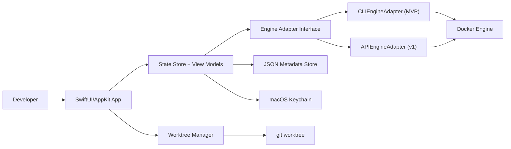

# miniDockerUI High-Level Architecture Design

## Purpose and Scope
miniDockerUI is a native macOS control-plane application for Docker Engine focused on developer workflows:
- container discovery and starring
- container lifecycle actions
- log viewing and search
- readiness detection
- git worktree switching with container restart

This document defines architecture decisions, component boundaries, interface contracts, and test strategy used to guide implementation.

## Product Boundary (What This Is / Is Not)
This project is:
- a UI/runtime layer for an existing Docker Engine endpoint
- a local-first macOS app distributed outside the Mac App Store
- a CLI-first integration in MVP with API parity path in v1

This project is not:
- a Docker runtime, VM, or engine replacement
- a Kubernetes management suite
- a generic arbitrary shell execution platform in MVP

## Architecture Principles
1. Native first: SwiftUI UI with targeted AppKit for high-volume log rendering.
2. Deterministic behavior: explicit state machines and event-driven reconciliation.
3. Least privilege: no implicit remote enablement; explicit user selection and trust.
4. Bounded resources: strict memory/time limits for logs, events, and retries.
5. Replaceable adapters: UI/state decoupled from CLI/API backend choice.
6. Testability: all core flows executable in non-interactive integration tests.

## System Context

## Module Architecture
- `/app`
- App entry, navigation, list/detail panes, settings UI
- `/core/state`
- domain models, reducers/store, persistence orchestration
- `/core/engine`
- adapter contracts and implementations
- `/core/engine/cli`
- docker command runner, parsers, stream supervisors
- `/core/engine/api` (v1)
- HTTP/streaming implementation
- `/core/logs`
- ring buffer, search, filters, load shedding
- `/core/readiness`
- health and regex trigger logic
- `/core/worktrees`
- git worktree parsing, mapping, switch orchestration
- `/tests`
- unit, integration, and stress suites

## Core Interfaces and Contracts
### Runtime Contracts
`EngineAdapter`
- `listContainers() -> [ContainerSummary]`
- `inspectContainer(id: String) -> ContainerDetail`
- `startContainer(id: String) -> Void`
- `stopContainer(id: String, timeoutSeconds: Int?) -> Void`
- `restartContainer(id: String, timeoutSeconds: Int?) -> Void`
- `streamEvents(since: Date?) -> AsyncThrowingStream<EventEnvelope, Error>`
- `streamLogs(id: String, options: LogStreamOptions) -> AsyncThrowingStream<LogEntry, Error>`

`EngineContext`
- `id`, `name`, `endpointType`, `isReachable`, `lastCheckedAt`
- MVP default: local context only

`ContainerSummary`
- `engineContextId`, `id`, `name`, `image`, `status`, `health`, `labels`, `startedAt`

`ContainerDetail`
- `summary`, `mounts`, `networkSettings`, `healthDetail`, `rawInspect`

`ContainerAction`
- enum: `start`, `stop`, `restart`, `viewLogs`, `inspect`
- MVP has built-ins only; user-defined templated allowlist is v1

`EventEnvelope`
- `sequence`, `eventAt`, `containerId`, `action`, `attributes`, `source`, `raw`

`LogEntry`
- `engineContextId`, `containerId`, `stream`, `timestamp`, `message`

`LogBufferPolicy`
- `maxLinesPerContainer`, `maxBytesPerContainer`, `dropStrategy`, `flushHz`

`ReadinessRule`
- `mode`: `healthOnly`, `healthThenRegex`, `regexOnly`
- `regexPattern`, `mustMatchCount`, `windowStartPolicy`

`WorktreeMapping`
- `id`, `repoRoot`, `anchorPath`, `targetType`, `targetId`, `restartPolicy`

`WorktreeSwitchPlan`
- `mappingId`, `fromWorktree`, `toWorktree`, `restartTargets`, `verifyRule`

`AppSettingsStore`
- JSON-backed schema versioned metadata for stars, mappings, preferences
- secrets/certs/tokens in Keychain only

### Public Test Contracts
`IntegrationEnvironmentProvider`
- `prepare() -> Void`
- `endpoint() -> EngineEndpoint`
- `teardown() -> Void`
- implementations: `DinDProviderLinux`, `DinDProviderMacOS`

`EngineTestClient`
- thin wrapper over production adapter contracts for list/actions/events/logs

`FixtureOrchestrator`
- create/remove fixtures with unique run IDs
- mandatory cleanup on success/failure/timeout

`ReadinessProbeHarness`
- verifies health/log readiness transitions with timestamp windows

`LogLoadGenerator`
- deterministic high-throughput log producer for stress assertions

## Primary Runtime Flows
1. Launch and preflight
- validate `docker` and `git` binaries
- load settings and mappings
- resolve active context and reachability

2. Container state bootstrap
- fetch list snapshot
- start event stream
- reconcile events onto snapshot state

3. Lifecycle actions
- dispatch built-in action
- execute via adapter
- apply optimistic state and reconcile with events/inspect

4. Log viewer
- open bounded stream
- append with backpressure and UI throttling
- search over active buffer

5. Readiness tracking
- health status signal preferred
- optional regex trigger from log stream
- reject stale lines outside current lifecycle window

6. Worktree switch
- validate mapping
- repoint anchor path
- restart mapped targets
- verify readiness and expose result

7. Recovery
- on stream/process failure: bounded retries
- after reconnect: full list resync then event replay window

## Data Model and Persistence
- JSON files:
- `schema_version`
- favorites (starred container keys)
- action preferences
- worktree mappings
- readiness rules
- transient UI prefs

- Keychain:
- endpoint credentials, TLS material, sensitive tokens

- Migration:
- semver-like schema version
- forward migration functions only
- no silent destructive downgrade

## Security and Trust Model
1. Explicit engine trust: user-selected context only.
2. No auto-enabling remote daemon access.
3. No arbitrary shell action execution in MVP.
4. Secret redaction in logs, telemetry, and error surfaces.
5. Developer ID outside-MAS distribution baseline.
6. Worktree operations constrained to user-mapped repo roots.

## Performance and Resource Budgets
- log stream UI flush rate: max 30 Hz
- default log ring cap: 10 MB per container
- default max lines: 100,000 per container
- event reconcile target: less than 200 ms for 1000 queued events
- action command timeout defaults and explicit cancellation support

## Error Handling and Recovery
- typed error taxonomy:
- dependency errors (`docker`/`git` missing)
- context errors (unreachable endpoint)
- command/protocol errors
- parse/contract errors
- policy errors (disallowed action/mapping)

- recovery policies:
- stream restart with exponential backoff and cap
- full resync after disconnect
- idempotent teardown for failed workflows
- user-facing actionable remediation messages

## Automated Integration Test Architecture
Integration tests must run fully programmatically without human input, both locally and in CI.

Design constraints:
1. No dependency on pre-existing host containers.
2. Ephemeral daemon endpoint per test run.
3. Fixture lifecycle fully managed by harness.
4. Forced cleanup and artifact capture on failure.
5. Test execution through production adapter interfaces.

Default backend profile:
- DinD-like ephemeral daemon for deterministic isolation.

## Test Environment Lifecycle (No Human Input)
1. Generate unique run ID.
2. Provider `prepare()` boots ephemeral daemon and performs health check.
3. `FixtureOrchestrator` provisions containers/networks prefixed with run ID.
4. Test cases execute through `EngineTestClient`.
5. Assertions validate lifecycle, events, logs, readiness, and worktree actions.
6. On success/failure/timeout, `teardown()` enforces idempotent cleanup.
7. On failure, collect daemon logs and test diagnostics as artifacts.

## CI Execution Topology
1. Linux CI job
- primary full integration matrix against `DinDProviderLinux`

2. macOS CI job
- same scenario matrix against `DinDProviderMacOS` profile
- validates process/runtime parity on macOS runners

3. Shared CI rules
- integration suite mandatory in CI, opt-in locally
- hard global timeout per suite
- bounded retries only
- upload logs/artifacts automatically on failures

## Determinism, Isolation, and Flake Controls
1. Fixed fixture image tags and explicit command arguments.
2. Polling with bounded retries and explicit timeout budgets.
3. Clock-skew-tolerant timestamp assertions.
4. Strict namespace isolation via run ID prefixes.
5. Retry-once allowed only for environment boot transients.
6. Teardown must be idempotent and forced on timeout.

## Integration Test Acceptance Criteria
1. Container list bootstrap + event-driven reconciliation is correct.
2. Start/stop/restart actions propagate success and failure states correctly.
3. Event stream disconnect triggers recovery and full state resync.
4. Log bursts do not violate memory caps or stall stream consumption.
5. Readiness checks avoid false positives from stale log lines.
6. Worktree switch flow validates mapping, restart, and post-restart readiness.
7. Secrets are absent from persisted metadata and captured logs.

## Testing and Quality Gates
- Unit tests:
- parser coverage for container list/events/log entries
- reducer/state transition correctness
- readiness and worktree decision logic

- Integration tests:
- fully automated harness defined above
- run in Linux and macOS CI jobs

- Stress tests:
- log flood and reconnect churn scenarios

- Merge gates:
- all unit tests green
- integration suite green
- no high-severity lint/type/test regressions

## Roadmap and Evolution Plan (MVP -> v1)
MVP:
1. SwiftUI + AppKit UI shell
2. CLI engine adapter
3. local context support
4. built-in actions only
5. bounded log search
6. readiness + worktree mapping flows
7. automated integration harness baseline

v1:
1. API engine adapter
2. optional indexed log storage
3. templated allowlisted custom actions
4. multi-context remote support
5. richer compose-aware grouping

## Known Risks and Mitigations
1. CI flakiness from daemon startup race
- mitigate with provider health gates and bounded retry
2. log overload causing UI lag
- mitigate with strict ring caps and throttled rendering
3. reconnect gaps causing stale state
- mitigate with mandatory snapshot resync
4. security drift in action extensibility
- mitigate with allowlist model and policy checks

## Traceability to Execution Plan
Architecture tasks are tracked in `/docs/execution_plan.md` with IDs:
- `ARCH-001` architecture baseline and contracts
- `TEST-ARCH-001` non-interactive integration test architecture
- `TEST-PIPE-001` CI topology for Linux/macOS automated integration suite
